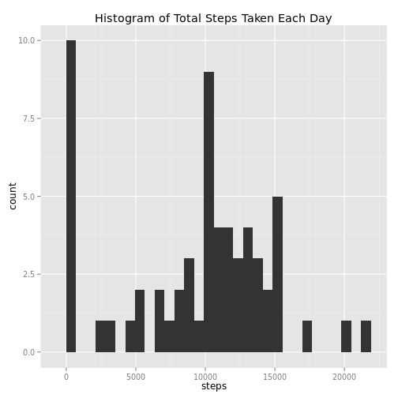
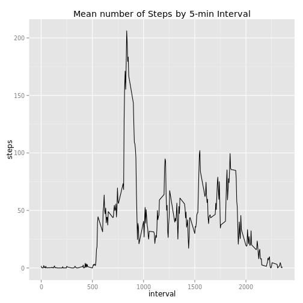
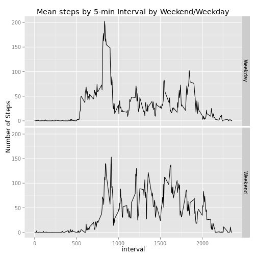

## Loading and preprocessing the data

Download the zip file, unzip it, and convert the date field to Date class. 


```r
library(dplyr)

zipFileName <- "activity.zip"
csvFileName <- "activity.csv"
url <- "https://d396qusza40orc.cloudfront.net/repdata%2Fdata%2Factivity.zip"
if (!file.exists(csvFileName)) {
    download.file(url, destfile = zipFileName, method = "curl")
}
unzip(zipFileName)
activity <- read.csv(csvFileName, colClasses = c("integer", "character", "integer"))
activity <- mutate(activity, date = as.Date(date))
```
    
## What is mean total number of steps taken per day?

Aggregate to total steps per day.


```r
activity %>%
    group_by(date) %>%
    summarise(
        steps = sum(steps, na.rm = TRUE)
    ) -> activityByDay
```
 
Histogram of number of steps per day.
 

```r
library(ggplot2)

ggplot(data = activityByDay, aes(steps)) + 
    geom_histogram() +
    labs(title = "Histogram of Total Steps Taken Each Day")
```

 

The mean and median number of steps taken each day is available in the output of the `summary` function under the `steps` column:


```r
summary(activityByDay)
```

```
##       date                steps      
##  Min.   :2012-10-01   Min.   :    0  
##  1st Qu.:2012-10-16   1st Qu.: 6778  
##  Median :2012-10-31   Median :10395  
##  Mean   :2012-10-31   Mean   : 9354  
##  3rd Qu.:2012-11-15   3rd Qu.:12811  
##  Max.   :2012-11-30   Max.   :21194
```

## What is the average daily activity pattern?

Aggregate to mean steps by 5-min interval.


```r
activity %>% 
    group_by(interval) %>%
    summarise(
        steps = mean(steps, na.rm = TRUE)
    ) -> activityByInterval
```

Plot time series of mean number of steps taken by 5-min interval.


```r
ggplot(data = activityByInterval, aes(interval, steps)) +
    geom_line() +
    labs(title = "Mean number of Steps by 5-min Interval")
```

 


Calculate which 5-min interval, on average across all the days in the dataset, contains the maximum number of steps.


```r
activityByInterval %>%
    filter(
        min_rank(desc(steps)) == 1
    )
```

```
## Source: local data frame [1 x 2]
## 
##   interval    steps
##      (int)    (dbl)
## 1      835 206.1698
```

## Imputing missing values
    
Calculate the total number of rows with missing values.


```r
sum(!complete.cases(activity))
```

```
## [1] 2304
```

We'll use the unsophisticated strategy of replacing NAs with the global median.


```r
stepsMedian <- median(activity$steps, na.rm = TRUE)

print(paste("The global median is:", stepsMedian))
```

```
## [1] "The global median is: 0"
```

```r
activity %>%
    mutate(
        steps = ifelse(is.na(steps), stepsMedian, steps)
    ) -> activityImputed
```

Aggregate to total steps per day.


```r
activityImputed %>%
    group_by(date) %>%
    summarise(
        steps = sum(steps, na.rm = TRUE)
    ) -> activityImputedByDay
```

Histogram of number of steps per day.
 

```r
ggplot(data = activityImputedByDay, aes(steps)) + 
    geom_histogram() +
    labs(title = "Histogram of Total Steps Taken Each Day")
```

 

The mean and median number of steps taken each day is available in the output of the `summary` function under the `steps` column:


```r
summary(activityImputedByDay)
```

```
##       date                steps      
##  Min.   :2012-10-01   Min.   :    0  
##  1st Qu.:2012-10-16   1st Qu.: 6778  
##  Median :2012-10-31   Median :10395  
##  Mean   :2012-10-31   Mean   : 9354  
##  3rd Qu.:2012-11-15   3rd Qu.:12811  
##  Max.   :2012-11-30   Max.   :21194
```

These values, based on the data with missing values imputed, are the same as those originally calculated on the data with missing values.  This happened because we originally used the `sum` function with the option `rm.na = TRUE`.  This behaves as though we imputed a value of 0 to the records with missing values.  But this is exactly what we did with the imputed data set.  We imputed with the global median which is 0. 
  
## Are there differences in activity patterns between weekdays and weekends?

Aggregate to mean steps by 5-min interval by Weekend/Weekday.


```r
activityImputed %>%
    mutate(
        weekend = factor(ifelse(weekdays(date) %in% 
                    c('Sunday', 'Saturday'), 'Weekend', 'Weekday'))
        ) %>%
    group_by(weekend, interval) %>%
    summarise(
        steps = mean(steps)
    ) -> activityImputedByWeekendInterval
```

Panel plot of mean steps by 5-min interval by Weekend/Weekday.


```r
ggplot(data = activityImputedByWeekendInterval, aes(interval, steps)) +
    geom_line() + 
    facet_grid(weekend ~ .) +
    labs(y = "Number of Steps") +
    labs(title = "Mean steps by 5-min Interval by Weekend/Weekday")
```

 
